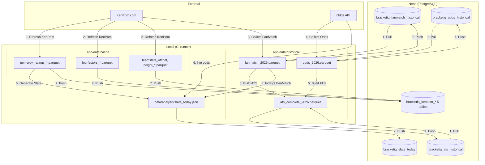

# BracketIQ Nightly Update — Flow

Runs **daily at 8 AM UTC** (3 AM EST) via GitHub Actions. This diagram shows how data moves between Neon, local files, and external APIs.

## Step summary

| Step | Script | Reads | Writes |
|------|--------|--------|--------|
| **1** | `pull_from_neon` | Neon: fanmatch, odds, ats | `app/data/historical/*.parquet` |
| **2** | `refresh_kenpom_cache` | KenPom.com | `app/data/cache/*.parquet` (pomeroy, fourfactors, teamstats, height) |
| **3** | `collect_historical_fanmatch` | KenPom.com | `fanmatch_2026.parquet` (incremental) |
| **4** | `collect_historical_odds` | Odds API | `odds_2026.parquet` (incremental) |
| **5** | `build_ats_dataset` | fanmatch + odds parquets | `ats_complete_2026.parquet` |
| **6** | `slate_today` | cache (pomeroy), fanmatch (today), Odds API (live) | `data/analysis/slate_today.json` |
| **7** | `push_to_neon` | cache + slate_today.json + historical parquets | All `bracketiq_*` tables in Neon |

## Neon tables (after push)

- **KenPom:** `bracketiq_kenpom_ratings`, `bracketiq_kenpom_fourfactors`, `bracketiq_kenpom_teamstats_off`, `bracketiq_kenpom_teamstats_def`, `bracketiq_kenpom_height`
- **Slate:** `bracketiq_slate_today`
- **Historical:** `bracketiq_fanmatch_historical`, `bracketiq_odds_historical`, `bracketiq_ats_historical`

The consumer app (BracketIQ API) reads only from these Neon tables; it does not use local parquets or run these scripts.
